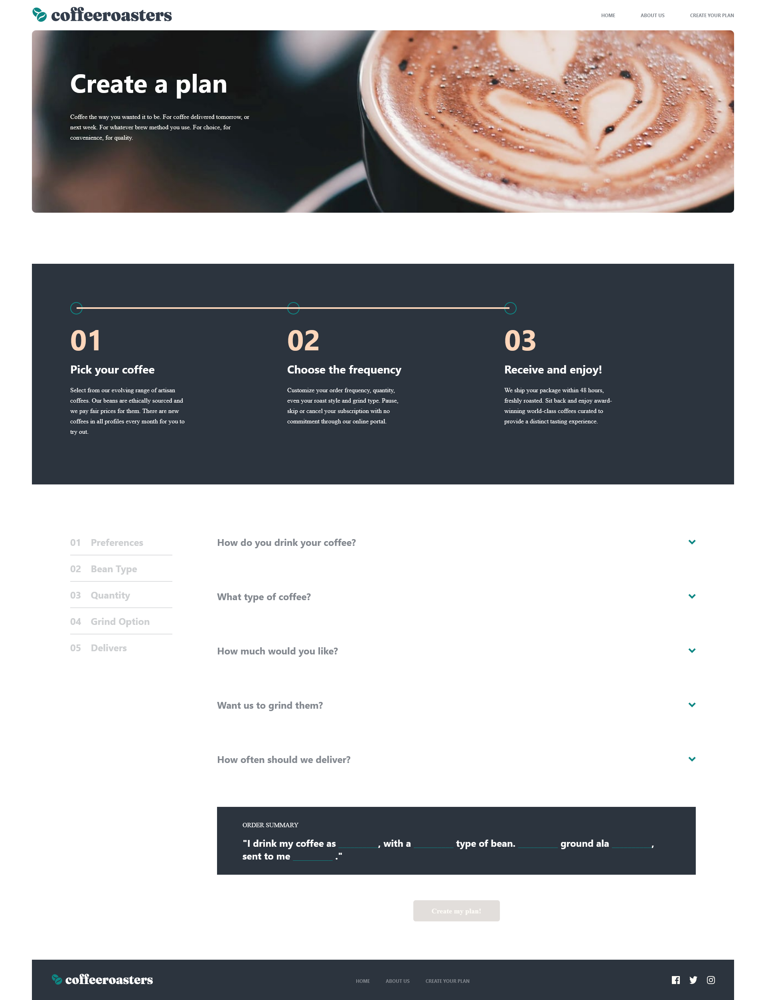

# Decagon assessment site solution

This is a solution to the challenge

## Table of contents

- [Overview](#overview)
  - [The challenge](#the-challenge)
  - [Screenshot](#screenshot)
  - [Links](#links)
  - [Built with](#built-with)
  - [What I learned](#what-i-learned)
  - [Useful resources](#useful-resources)
- [Author](#author)

## Overview
This app is a front end app that was built with React Library and styled component.
### The challenge

Users should be able to:

- View the optimal layout for each page depending on their device's screen size
- See hover states for all interactive elements throughout the site
- Make selections to create a coffee subscription and see an order summary modal of their choices

### Screenshot



### Links

- Live Site URL: [Add live site URL here](https://teeliny-coffee.netlify.app/)

### Built with

- Semantic HTML5 markup
- CSS custom properties
- Flexbox
- CSS Grid
- Mobile-first workflow
- [React](https://reactjs.org/) - JS library
- [Styled Components](https://styled-components.com/) - For styles

### What I learned

- How to center a modal with transform property instead of flex/grid
```css
.move__to__center {
  position: absolute;
  top: 50%;
  left: 50%;
  transform: translate(-50%, -50%);
}
```
- How to pass prop to styled-component
- Changing image based on screen size using useEffect hook
```js
  useEffect(() => {
    function handleResize() {
      setWidth(window.innerWidth)
    }
    window.addEventListener('resize', handleResize)
  });
```

### Useful resources

- [Example resource 1](https://www.pluralsight.com/guides/re-render-react-component-on-window-resize) - This helped me to render a component on window resize.
- [Example resource 2](https://www.example.com) - This is an amazing article which helped me finally understand XYZ. I'd recommend it to anyone still learning this concept.

## Author

- Website - [Add your name here](https://github.com/teeliny)

